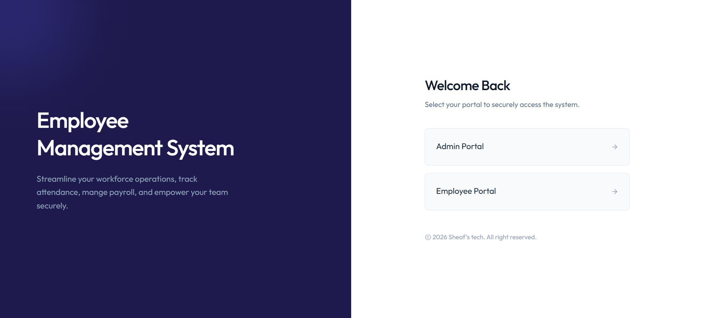
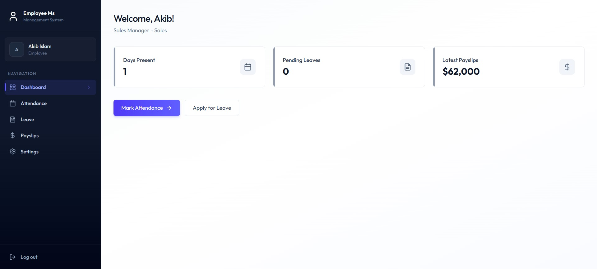
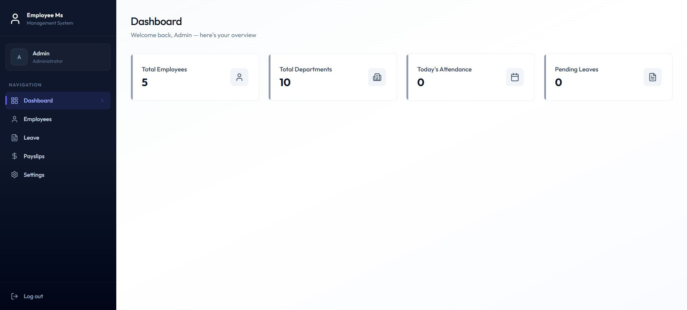

# Employee Management System

A full-stack employee management platform built with React, Tailwind CSS, JavaScript, Node.js, Express.js, MongoDB, and Inngest.

## Project Preview

## Features

* Role-based authentication for Admin and Employee
* Admin and Employee dashboards
* Employee management
* Attendance management
* Leave management
* Payslip management
* REST APIs
* Background jobs and scheduled tasks with Inngest

## Tech Stack

* React.js
* JavaScript
* Tailwind CSS
* Node.js
* Express.js
* MongoDB
* Inngest

## Live Demo

https://employee-management-system-omega-bay.vercel.app/login
